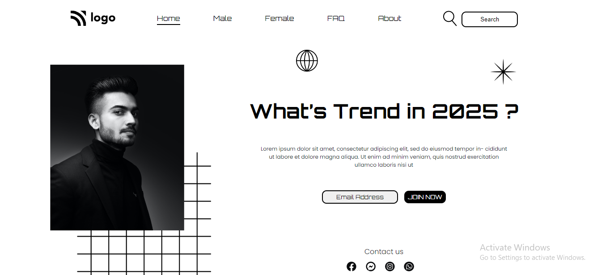

# Assignment 1

# Project 1 [Link Link](https://street-style-landing.netlify.app/)

### What I Learned from this Project?

- I learned about positioning around the webpage.
- I also learned how to add different fonts from the Google fonts.
- I also learned how to design Buttons and Navbar.
- Learnd to use css position [Relative & Absolute] property.

### This project took around 5 hours to complete.

### Screenshot

